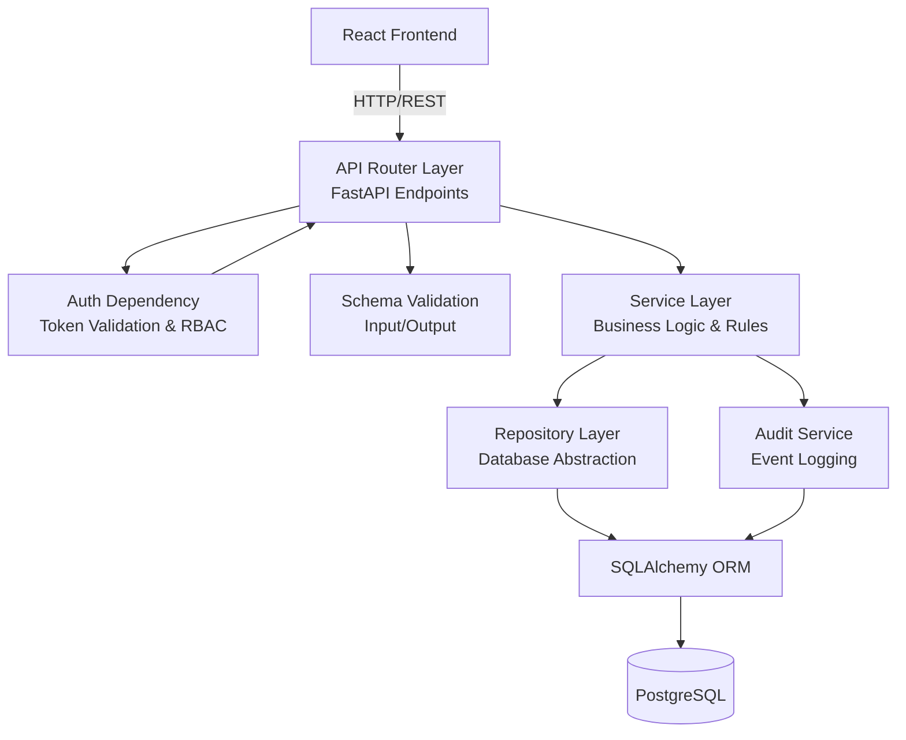

# FreightFlow - Architectural Specification

This document outlines the complete architectural design for the FreightFlow marketplace POC. The architecture is designed to be highly scalable, enterprise-grade, and strictly adheres to SOLID principles and a feature-based module structure.

---

## 1. Complete System Architecture

FreightFlow follows a standard modern decoupled Client-Server architecture.

*   **Client (Frontend)**: A React SPA (Single Page Application) built with TypeScript, Vite, and Tailwind CSS. It communicates with the backend purely via RESTful API calls using Axios. State management is handled globally by Zustand and locally via React hooks.
*   **Server (Backend)**: A Python FastAPI application acting as the API Gateway and Business Logic Layer. It is asynchronous, fast, and uses Pydantic for data validation.
*   **Database Layer**: PostgreSQL as the primary relational database, accessed via SQLAlchemy (ORM) and Alembic for migrations.
*   **Security**: Stateless authentication using JWT (JSON Web Tokens). Passwords are encrypted using bcrypt.

---

## 2. Folder Structure (Feature-Based)

To avoid "spaghetti code", the project uses a **Feature-Based (Modular) Architecture** rather than separating by technical concern (e.g., all controllers together, all models together).

### Backend (FastAPI)
```text
backend/
├── app/
│   ├── core/               # Global configs, security (JWT, hashing), custom exceptions
│   ├── db/                 # DB connection, base SQLAlchemy models, Alembic env
│   ├── api/                # Base API router linking all module routers
│   ├── modules/            # Domain-driven feature modules
│   │   ├── auth/           # Login, registration, token generation
│   │   ├── users/          # User management, profile
│   │   ├── companies/      # Company profiles, verification
│   │   ├── loads/          # Load creation, marketplace listing
│   │   ├── bids/           # Bid submission and evaluation
│   │   ├── tenders/        # Tender awarding and acceptance
│   │   ├── tracking/       # Driver assignment, location tracking
│   │   └── audits/         # Audit logging
│   │
│   │   # Inside EACH module (e.g., loads/):
│   │   # ├── router.py       (API Endpoints)
│   │   # ├── service.py      (Business Logic)
│   │   # ├── repository.py   (Database CRUD)
│   │   # ├── schemas.py      (Pydantic Models / DTOs)
│   │   # └── models.py       (SQLAlchemy Models)
│   │
│   └── main.py             # FastAPI application entry point
├── tests/                  # Pytest unit and integration tests
├── alembic/                # Database migrations
└── requirements.txt
```

### Frontend (React/Vite)
```text
frontend/
├── src/
│   ├── assets/             # Static files, images, icons
│   ├── components/         # Reusable Shadcn UI & generic layout components
│   ├── core/               # Axios instances, theme config, global constants
│   ├── hooks/              # Global custom hooks (e.g., useAuth)
│   ├── store/              # Global Zustand stores (AuthStore, UIStore)
│   ├── modules/            # Domain-driven feature modules
│   │   ├── auth/
│   │   ├── dashboard/
│   │   ├── loads/
│   │   ├── bids/
│   │   └── company/
│   │
│   │   # Inside EACH module (e.g., loads/):
│   │   # ├── components/     (Module-specific components)
│   │   # ├── pages/          (Route-level components)
│   │   # ├── store.ts        (Module-specific Zustand store)
│   │   # ├── api.ts          (Module-specific Axios calls)
│   │   # └── types.ts        (Zod schemas and TS interfaces)
│   │
│   ├── router/             # React Router configuration & guards
│   ├── utils/              # Helper functions (formatters, dates)
│   ├── App.tsx
│   └── main.tsx
├── tailwind.config.js
└── package.json
```

---

## 3. Feature Modules

The application is divided into cohesive, decoupled domains:

1.  **Identity & Access Module**: Authentication, JWT lifecycle, RBAC enforcement, employee onboarding.
2.  **Company & Fleet Module**: Company profiles, document verification status, driver management, equipment tracking.
3.  **Marketplace (Load Board) Module**: Posting loads, viewing the public/private load board, load filtering and search.
4.  **Bidding & Tendering Module**: Submitting bids, comparing bids, awarding tenders, accepting/rejecting tenders, expiring tenders.
5.  **Execution & Tracking Module**: Driver assignment, status updates (Pickup -> In Transit -> Delivered), dispute logging.
6.  **Audit & Compliance Module**: Immutable logging of all state changes and critical read/write actions.

---

## 4. Database Architecture (Key Entities)

*   `users`: Stores employee credentials. Links to `companies` and `roles`.
*   `roles`: Stores RBAC definitions.
*   `companies`: Stores company details, verification status, and type (`SHIPPER`, `BROKER`, `CARRIER`, `OWNER_OPERATOR`).
*   `loads`: Created by Shippers/Brokers. Contains origin, destination, requirements, and strict status (`DRAFT`, `OPEN_FOR_BIDDING`, etc.).
*   `bids`: Belongs to a load and a bidding company. Tracks amount and expiration.
*   `tenders`: Connects a Load to a specific Bid. Tracks tender status and expiration.
*   `shipments`: The execution phase of a Load. Tracks assigned driver and real-time statuses.
*   `audit_logs`: Append-only table tracking `user_id`, `action`, `resource`, `timestamp`.

---

## 5. API Architecture (RESTful)

APIs strictly follow REST conventions, returning standard JSON structures.

*   `POST /api/v1/auth/login`
*   `GET /api/v1/companies/me`
*   `POST /api/v1/loads` (Create Load)
*   `GET /api/v1/loads/marketplace` (View open loads)
*   `POST /api/v1/loads/{load_id}/bids` (Submit Bid)
*   `GET /api/v1/loads/{load_id}/bids` (View Bids - Shipper only)
*   `POST /api/v1/bids/{bid_id}/tender` (Award Tender)
*   `POST /api/v1/tenders/{tender_id}/accept` (Accept Tender)
*   `PATCH /api/v1/shipments/{shipment_id}/status` (Update transit status)

---

## 6. RBAC Architecture

Permissions are resolved dynamically based on User $\rightarrow$ Role $\rightarrow$ Permissions.

*   **Enforcement**: Handled via FastAPI dependencies. E.g., `@router.post("/loads", dependencies=[Depends(RequirePermission("loads:create"))])`.
*   **Role Hierarchy**:
    *   `SUPER_ADMIN`: System-wide access.
    *   `COMPANY_ADMIN`: Can manage company employees and settings.
    *   `SHIPPER_OPS` / `BROKER_OPS`: Can create loads, award tenders.
    *   `CARRIER_DISPATCH`: Can view load board, place bids, assign drivers.
    *   `DRIVER`: Mobile/App view only; can only update assigned shipment status.
*   **Tenant Isolation**: A user can only read/write data associated with their own `company_id` (enforced at the Repository level).

---

## 7. Service Layer

The **Service Layer** isolates business logic from HTTP transport (Routers) and database queries (Repositories). 

*   **Rule Engine**: Handles business rules (e.g., "A load cannot be edited after bidding starts").
*   **Transactions**: Orchestrates multi-step processes. For example, `TenderService.accept_tender()` will:
    1. Mark the specific tender as `ACCEPTED`.
    2. Change the Load status to `DRIVER_ASSIGNMENT_PENDING`.
    3. Invalidate all other pending bids for that load.
    4. Call `AuditService` to log the transaction.

---

## 8. Repository Layer

The **Repository Layer** abstracts the SQLAlchemy ORM. The Service layer never imports SQLAlchemy directly.

*   **Interface**: Exposes standard methods like `get_by_id`, `create`, `update`, `list`.
*   **Data Isolation**: Every query in the repository automatically appends tenant-filtering (e.g., `where company_id = current_user.company_id`) unless explicitly bypassed for marketplace queries.
*   **Testability**: Allows the backend to be heavily unit-tested by mocking database interactions.

---

## 9. Dependency Diagram


