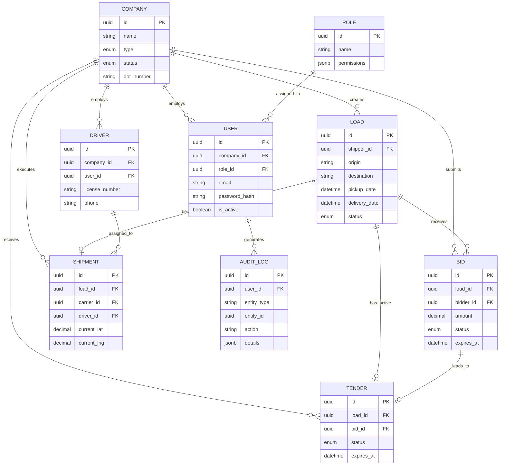

# FreightFlow - Database Architecture

This document outlines the complete database schema for the FreightFlow platform. It strictly focuses on the data layer, avoiding any API or frontend implementations.

## 1. Entity-Relationship (ER) Diagram

---

## 2. Status Enums

These enumerations enforce strict business logic at the database level.

*   **CompanyType**: `SHIPPER`, `BROKER`, `CARRIER`, `OWNER_OPERATOR`
*   **VerificationStatus**: `PENDING`, `VERIFIED`, `REJECTED`, `SUSPENDED`
*   **LoadStatus** (Matches Shipment Lifecycle): `DRAFT`, `OPEN_FOR_BIDDING`, `TENDER_SENT`, `TENDER_ACCEPTED`, `DRIVER_ASSIGNED`, `PICKUP_COMPLETED`, `IN_TRANSIT`, `DELIVERED`, `COMPLETED`, `CANCELLED`, `EXPIRED`, `ON_HOLD`, `DISPUTED`
*   **BidStatus**: `PENDING`, `ACCEPTED`, `REJECTED`, `EXPIRED`, `WITHDRAWN`, `INVALIDATED` (when load is edited)
*   **TenderStatus**: `PENDING`, `ACCEPTED`, `REJECTED`, `EXPIRED`, `CANCELLED`
*   **PaymentStatus**: `PENDING`, `INVOICED`, `PAID`, `OVERDUE`

---

## 3. Database Tables & Relationships

### `companies`
Core entity representing organizations on the platform.
*   **Columns**: `id` (UUID, PK), `name` (VARCHAR), `type` (CompanyType), `status` (VerificationStatus), `dot_number` (VARCHAR, Nullable), `created_at`, `updated_at`.
*   **Constraints**: `name` (UNIQUE), `dot_number` (UNIQUE where not null).
*   **Indexes**: `type`, `status`.

### `roles`
Stores RBAC configurations.
*   **Columns**: `id` (UUID, PK), `name` (VARCHAR), `permissions` (JSONB), `created_at`.
*   **Constraints**: `name` (UNIQUE).

### `users`
Employees belonging to companies.
*   **Columns**: `id` (UUID, PK), `company_id` (UUID), `role_id` (UUID), `email` (VARCHAR), `password_hash` (VARCHAR), `is_active` (BOOLEAN), `created_at`.
*   **Foreign Keys**: 
    *   `company_id` -> `companies.id` (ON DELETE CASCADE)
    *   `role_id` -> `roles.id` (ON DELETE RESTRICT)
*   **Constraints**: `email` (UNIQUE).
*   **Indexes**: `company_id`, `email`.

### `drivers`
Specific entity for drivers, owned by Carriers/Owner-Operators.
*   **Columns**: `id` (UUID, PK), `company_id` (UUID), `user_id` (UUID, Nullable), `license_number` (VARCHAR), `phone` (VARCHAR).
*   **Foreign Keys**:
    *   `company_id` -> `companies.id` (ON DELETE CASCADE)
    *   `user_id` -> `users.id` (ON DELETE SET NULL)
*   **Constraints**: `license_number` (UNIQUE).

### `loads`
The central freight entity created by Shippers.
*   **Columns**: `id` (UUID, PK), `shipper_id` (UUID), `origin_address` (TEXT), `destination_address` (TEXT), `pickup_date` (TIMESTAMP), `delivery_date` (TIMESTAMP), `equipment_type` (VARCHAR), `weight_lbs` (INT), `status` (LoadStatus), `created_at`, `updated_at`.
*   **Foreign Keys**: `shipper_id` -> `companies.id` (ON DELETE RESTRICT).
*   **Indexes**: `status`, `shipper_id`, `pickup_date`.

### `bids`
Offers made by Carriers/Brokers on a specific load.
*   **Columns**: `id` (UUID, PK), `load_id` (UUID), `bidder_id` (UUID), `amount` (DECIMAL 10,2), `status` (BidStatus), `expires_at` (TIMESTAMP), `created_at`.
*   **Foreign Keys**: 
    *   `load_id` -> `loads.id` (ON DELETE CASCADE)
    *   `bidder_id` -> `companies.id` (ON DELETE RESTRICT)
*   **Constraints**: UNIQUE(`load_id`, `bidder_id`) *Partial Index where status = 'PENDING'* (prevents multiple active bids from same carrier on same load).
*   **Indexes**: `load_id`, `bidder_id`.

### `tenders`
Awarded contracts waiting for carrier acceptance.
*   **Columns**: `id` (UUID, PK), `load_id` (UUID), `bid_id` (UUID), `shipper_id` (UUID), `bidder_id` (UUID), `status` (TenderStatus), `expires_at` (TIMESTAMP).
*   **Foreign Keys**: 
    *   `load_id` -> `loads.id` (ON DELETE CASCADE)
    *   `bid_id` -> `bids.id` (ON DELETE RESTRICT)
    *   `shipper_id` -> `companies.id` (ON DELETE RESTRICT)
    *   `bidder_id` -> `companies.id` (ON DELETE RESTRICT)
*   **Constraints**: UNIQUE(`load_id`) *Partial Index where status = 'PENDING'* (A load can only have ONE active tender).

### `shipments`
The execution record of an accepted tender.
*   **Columns**: `id` (UUID, PK), `load_id` (UUID), `carrier_id` (UUID), `driver_id` (UUID, Nullable), `current_lat` (DECIMAL, Nullable), `current_lng` (DECIMAL, Nullable), `created_at`, `updated_at`.
*   **Foreign Keys**: 
    *   `load_id` -> `loads.id` (ON DELETE CASCADE)
    *   `carrier_id` -> `companies.id` (ON DELETE RESTRICT)
    *   `driver_id` -> `drivers.id` (ON DELETE SET NULL)
*   **Constraints**: UNIQUE(`load_id`). (1-to-1 relationship with Load once awarded).

### `audit_logs`
Immutable ledger of all critical platform actions.
*   **Columns**: `id` (UUID, PK), `user_id` (UUID), `company_id` (UUID), `action` (VARCHAR), `entity_type` (VARCHAR), `entity_id` (UUID), `old_values` (JSONB), `new_values` (JSONB), `timestamp` (TIMESTAMP).
*   **Foreign Keys**: 
    *   `user_id` -> `users.id` (ON DELETE SET NULL)
    *   `company_id` -> `companies.id` (ON DELETE SET NULL)
*   **Constraints**: Table is APPEND ONLY (enforced via DB triggers if possible).
*   **Indexes**: `entity_type` + `entity_id` (for fast timeline generation), `company_id`.

### `disputes` & `ratings` (Supplementary)
*   **disputes**: `id`, `load_id` (FK), `raiser_id` (FK), `reason`, `status`.
*   **ratings**: `id`, `load_id` (FK), `reviewer_id` (FK), `reviewee_id` (FK), `score` (1-5).

---

## 4. Key Cascade Rules & Business Logic Enforcements

1.  **Deletions**: Soft deletes (using an `is_deleted` flag or statuses) are highly preferred in enterprise systems over Hard Deletes. However, if a `Load` is hard-deleted, `CASCADE` rules automatically remove associated `Bids` and `Tenders` to prevent orphaned financial records. 
2.  **Companies**: `companies` deletion is `RESTRICT`ed if they have associated users, loads, or bids. You must disable the company instead.
3.  **Roles**: `roles` cannot be deleted (`RESTRICT`) if users are assigned to them.
4.  **One Active Tender Rule**: Enforced by a partial unique index on `tenders.load_id` WHERE `status = 'PENDING'`. The database physically prevents a shipper from sending a second tender for the same load if one is currently pending.
